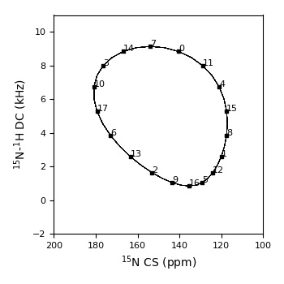
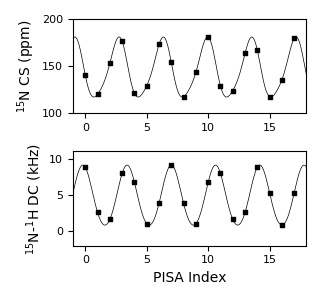

# pisa.py

A python tool for simulating and fitting PISA wheels to oriented solid-state NMR data.

### Citation

Manuscript in preparation.

### Installation

#### Python 3

The pisa.py script requires Python 3. An easy way to install Python 3 is by the [Anaconda Package](https://www.anaconda.com/distribution/), which includes all required libraries.

#### Nmrglue (optional)

The [Nmrglue](http://nmrglue.readthedocs.io/en/latest/install.html) python library is recommended for producing overlaying results against spectra in NMRPipe or Sparky format.

### Example usage

#### 1. Simple simulation

This first example reproduces Figure 8 of [Denny et al. (2001)](https://www.sciencedirect.com/science/article/abs/pii/S109078070192405X?via%3Dihub). Note the default N15 chemical shift tensor components and structural parameters used by pisa.py differ from this reference and require to by explicity stated in order to be overwritten. In a command line, enter:

	python pisa.py \
       	-t 35.0 \
       	-r -10.0 \
       	-o 1.0 \
       	--nres 18 \
       	--seq_start 0 \
       	--rho_start 0 \
       	--phi -65 \
       	--psi -40 \
       	--aCaCN 115.0 \
      	--aCNCa 121.0 \
       	--aNCaC 110.0 \
       	--aCaNH 117.0 \
       	--bCaC 1.53 \
       	--bCN 1.34 \
       	--pas 31 55 202 \
       	--out_wave denny_wave.dat \
      	--out_log denny_log.dat

Or run as a bash script [denny.sh](examples/denny/denny.sh) by:

	bash denny.sh

The results contained in the log ([denny_log.dat](examples/denny/denny_log.dat)) and wave ([denny_wave.dat](examples/denny/denny_wave.dat)) files can be visualized using the Matplotlib Python library. This script ([denny_plot.py](examples/denny/denny_plot.py)) will plot the PISA wheel:

	python denny_plot.py

And a wave plot representation can be generated by the script ([denny_wave.py](examples/denny/denny_wave.py)):

	python denny_wave.py

