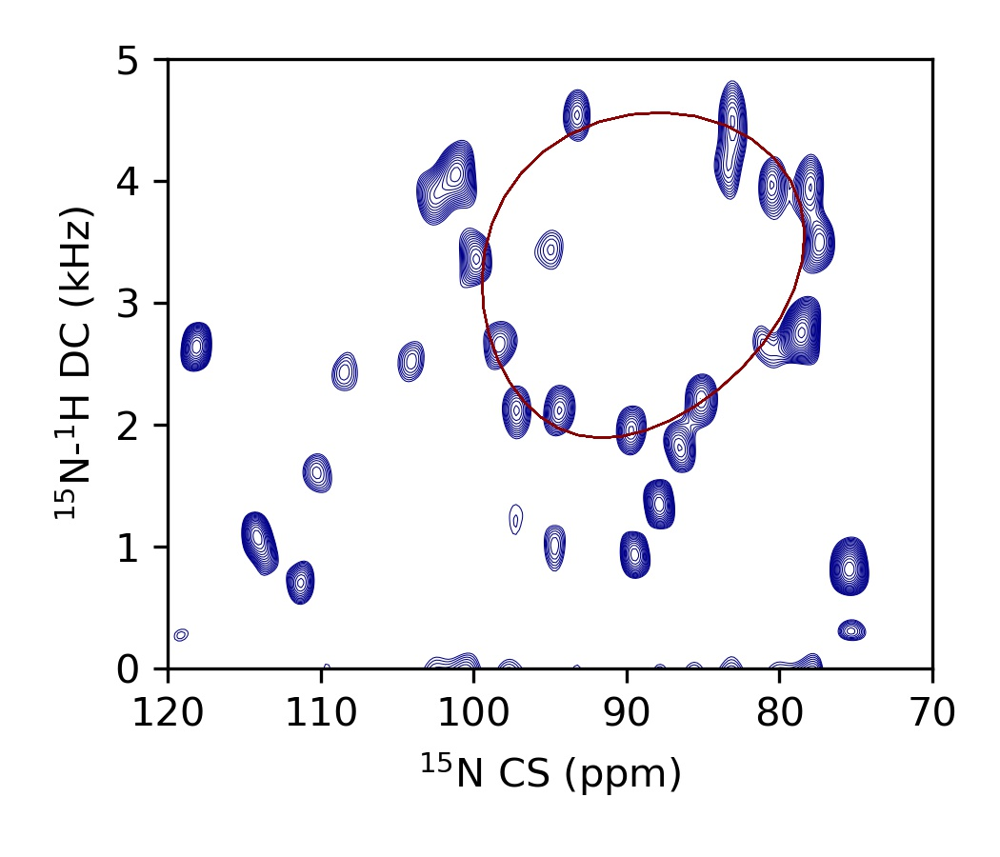
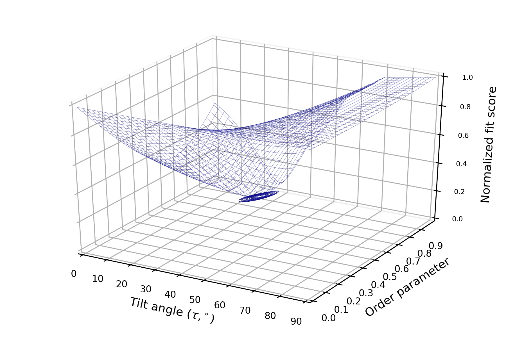
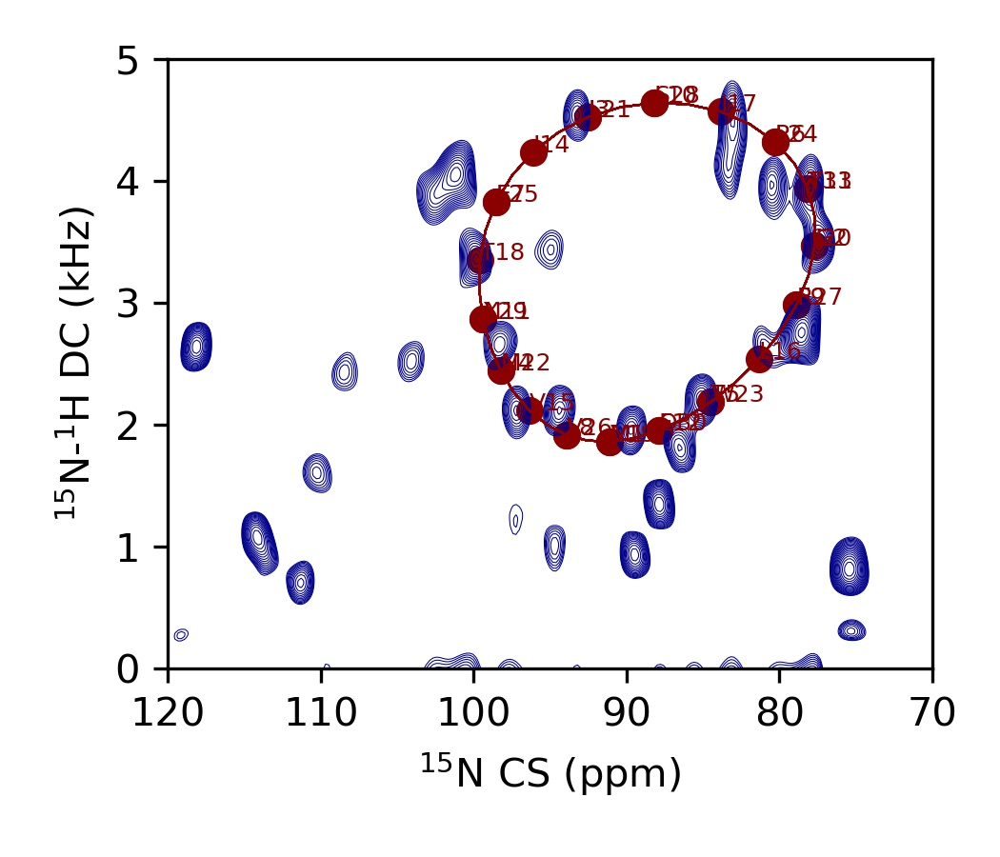

# pisa.py

A python tool for simulating and fitting PISA wheels to oriented solid-state NMR data.

This page is still under construction and will include more usage information over time. Meanwhile, users are encouraged to read the associated manuscript (see bottom of this page) and supplementary information for further details.

## PISA-SPARKY Plugin

The [*pisa.py*](pisa.py) script is hosted on NMRFAM servers and can be used remotely from the PISA-SPARKY GUI plugin available with [NMRFAM-SPARKY](http://pine.nmrfam.wisc.edu/download_packages.html) as of Dec 2019. Usage of the GUI is highly recommended, although the [*pisa.py*](pisa.py) script can be used as a standalone command line tool as described in later sections.

### Video tutorial

A video tutorial for the plugin is available on YouTube:

The example data used for this tutorial can be downloaded from Zenodo [here](https://zenodo.org/record/3596955/files/sarcolipin_unflippedbicelle_pisa-sparky.zip?download=1).

### Additional information

#### Dipolar coupling restraints for Ponderosa

The plugin has the function to generate dipolar coupling restraints for the structural calculations using the Ponderosa Server. Note that these restraints are identical to the format used by CYANA, although the user will have to manually specify the rhombicity and magnitude since values of 999 and 999 arbitrarily set by default are not acceptable for CYANA. Ponderosa Server calculates rhombicity and magnitude during structure calculation simultaneously and also generates XPLOR/CNS format.

#### Using oriented restraints with XPLOR-NIH

Check out [hyrbid-method](https://github.com/weberdak/hybrid-method) for a complete tutorial and XPLOR-NIH code.

## Standalone usage 

The following sections descibe how to use the *pisa.py* script as a standalone command-line tool. Users will require at least a basic working knowledge of Python.

### System requirements

To run the [*pisa.py*](pisa.py), users will need Python 3 installed and containing the following libraries:

* pandas
* numpy
* math
* itertools
* argparse
* time
* random
* concurrent.futures

Visualization of results will require: 

* [nmrglue](http://nmrglue.readthedocs.io/en/latest/install.html)
* matplotlib

Note that installing Python 3 using the [Anaconda](https://www.anaconda.com/distribution/) distrubution will satisfy all these dependancies except for [nmrglue](http://nmrglue.readthedocs.io/en/latest/install.html), which will need to be installed manually.

### Usage

	python pisa.py -h
	
	usage: pisa.py [-h] [-t TAU] [-r RHO0] [-o ORDER] [--phi PHI] [--psi PSI]
	               [--beta BETA] [--dc DC] [--pas PAS [PAS ...]] [-s SEQ]
	               [--seq_start SEQ_START] [--rho_start RHO_START] [-n NRES]
	               [--flip FLIP] [--period PERIOD] [--negative_dc] [--aCaCN ACACN]
	               [--aCNCa ACNCA] [--aNCaC ANCAC] [--aCaNH ACANH] [--bCaC BCAC]
	               [--bCN BCN] [--bNCa BNCA] [-f PEAKS]
	               [--quickfit QUICKFIT [QUICKFIT ...]] [--explore]
	               [--fit_tau FIT_TAU [FIT_TAU ...]]
	               [--fit_rho0 FIT_RHO0 [FIT_RHO0 ...]]
	               [--fit_order FIT_ORDER [FIT_ORDER ...]] [--scalar SCALAR]
	               [--fit_only FIT_ONLY [FIT_ONLY ...]]
	               [--fit_exclude FIT_EXCLUDE [FIT_EXCLUDE ...]]
	               [--show_only SHOW_ONLY [SHOW_ONLY ...]] [--out_log OUT_LOG]
	               [--out_wave OUT_WAVE] [--out_fit OUT_FIT]
	               [--errors ERRORS [ERRORS ...]] [--procs PROCS]
	
	A python tool for simulating and fitting PISA wheels to oriented solid-state NMR data.
	
	optional arguments:
	  -h, --help            show this help message and exit
	  -t TAU, --tau TAU     Helical tilt angle in degrees (20.0).
	  -r RHO0, --rho0 RHO0  Azimuthal angle of reference residue (0.0).
	  -o ORDER, --order ORDER
	                        Order parameter (1.0).
	  --phi PHI             Phi dihedral angle for an ideal helix in degrees (-63.0).
	  --psi PSI             Psi dihedral angle for an ideal helix in degrees (-42.0).
	  --beta BETA           Beta rotation of the 15N PAS with respect to the amide plane in degrees (17.0).
	  --dc DC               Maximum 15N-1H dipolar coupling in kHz (10.735).
	  --pas PAS [PAS ...]   N15 principal axis system components in ppm (57.3 81.2 228.1).
	  -s SEQ, --seq SEQ     Single-letter amino acid sequence of the protein (none).
	  --seq_start SEQ_START
	                        Starting residue number in the sequence (1).
	  --rho_start RHO_START
	                        Residue number to reference as zero in all PISA calculations. I.e., residue of rho0 angle (1).
	  -n NRES, --nres NRES  Number of residues to simulate (18 or determined from --seq)
	  --flip FLIP           Angle of membrane normal to magnetic field in degrees (0.0).
	  --period PERIOD       Number of residues per helical rotation (3.6).
	  --negative_dc         Output all dipolar couplings as negative values in output files.
	  --aCaCN ACACN         Angle of Ca-C-N in degrees (117.5).
	  --aCNCa ACNCA         Angle of C-N-Ca in degrees (124.0).
	  --aNCaC ANCAC         Angle of N-Ca-C in degrees (107.4).
	  --aCaNH ACANH         Angle of Ca-N-H in degrees (116.0).
	  --bCaC BCAC           Length of Ca-C bond in angstroms (1.52).
	  --bCN BCN             Length of C-N bond in angstroms (1.35).
	  --bNCa BNCA           Length of N-Ca bond in angstroms (1.45).
	  -f PEAKS, --peaks PEAKS
	                        Input peak list file.
	  --quickfit QUICKFIT [QUICKFIT ...]
	                        Min. CS, max. CS, min. DC, max. DC. Explore combinations of tau angles and order parameters to best fit these bounds.
	  --explore             Specify to explore combinations of tau, rho0 and order to best fit input peak list.
	  --fit_tau FIT_TAU [FIT_TAU ...]
	                    	Min., max. and step to fit the tilt angle (0.0 90.0 1.0).
	  --fit_rho0 FIT_RHO0 [FIT_RHO0 ...]
	                    	Min., max. and step to fit the azimuthal angle (0.0 360.0 4.0).
	  --fit_order FIT_ORDER [FIT_ORDER ...]
	                    	Min., max. and step to fit the order parameter (0.85 0.85 0.1).
	  --scalar SCALAR       Value to scale up dipolar couplings to match chemical shift dispersion (10.0)
	  --fit_only FIT_ONLY [FIT_ONLY ...]
	                    	Only fit wheel to these residues (none).
	  --fit_exclude FIT_EXCLUDE [FIT_EXCLUDE ...]
	                    	Exclude these residues from fitting (none).
	  --show_only SHOW_ONLY [SHOW_ONLY ...]
	                    	Display only these residues in the output files (none).
	  --out_log OUT_LOG     File name/path of output log file (pisa_log.dat).
	  --out_wave OUT_WAVE   File name/path of output wave file (pisa_wave.dat).
	  --out_fit OUT_FIT     File name/path of output fit file (pisa_fit.dat).
	  --errors ERRORS [ERRORS ...]
	                    	Peroform error analysis for explore function. Specify three numbers: number of replicates (int),  avg. linewidths in CS (ppm) and DC (kHz) dimensions.
	  --procs PROCS         Number of CPUs to use in explore and quickfit functions (32).

### Example usage

#### 1. Simple simulation

This first example reproduces Figure 8 of [Denny et al. (2001)](https://www.sciencedirect.com/science/article/abs/pii/S109078070192405X?via%3Dihub). Note the default N15 chemical shift tensor components and structural parameters used by pisa.py differ from this reference and require to by explicity stated in order to be overwritten. In a command line, enter:

	python pisa.py \
	   	-t 35.0 \
	   	-r -10.0 \
	   	-o 1.0 \
	   	--nres 18 \
	   	--seq_start 0 \
	   	--rho_start 0 \
	   	--phi -65 \
	   	--psi -40 \
	   	--aCaCN 115.0 \
	  	--aCNCa 121.0 \
	   	--aNCaC 110.0 \
	   	--aCaNH 117.0 \
	   	--bCaC 1.53 \
	   	--bCN 1.34 \
	   	--pas 31 55 202 \
	   	--out_wave denny_wave.dat \
	  	--out_log denny_log.dat

Or run as a bash script [denny.sh](examples/denny/denny.sh) by:

	bash denny.sh

The results contained in the log ([denny_log.dat](examples/denny/denny_log.dat)) and wave ([denny_wave.dat](examples/denny/denny_wave.dat)) files can be visualized using the Matplotlib Python library. This script ([denny_plot.py](examples/denny/denny_plot.py)) will plot the PISA wheel:

	python denny_plot.py

And a wave plot representation can be generated by the script ([denny_wave.py](examples/denny/denny_wave.py)):

	python denny_wave.py

#### 2. Fitting to bounds of experimental spectra (quickfit)

Before making assignments, it is useful to fit a PISA wheel to spectra for roughly determining the tilt angle of the protein. Using an SLF spectrum of sarcolipin in unflipped bicelles as an example, a wheel may be fit to the lower and upper bounds of the chemical shifts and dipolar couplings by the following [command](examples/sarcolipin/sln_quickfit.sh) using the quickfit option:

	python pisa.py \
	   --flip 90.0 \
	   --quickfit 77.4 101.2 2.0 4.5 \
	   --fit_tau 0.0 90.0 1.0 \
	   --fit_order 0.00 1.00 0.01 \
	   --out_log sln_quickfit_log.dat \
	   --out_wave sln_quickfit_wave.dat \
	   --out_fit sln_quickfit_fit.dat

  This produces the log ([sln_quickfit_log.dat](examples/sarcolipin/sln_quickfit_log.dat)) and wave file ([sln_quickfit_wave.dat](examples/sarcolipin/sln_quickfit_wave.dat)) that can be overlaid with the spectrum using this script ([sln_quickfit_overlay.py](sarcolipin/sln_quickfit_overlay.py)) by:

 	python sln_quickfit_overlay.py

 

The quality of the fit can be assessed by creating a surface plot of the fitting score for each tilt angle and order parameter recorded in the fit file ([sln_quickfit_fit.dat](examples/sarcolipin/sln_quickfit_fit.dat)) using the script ([sln_quickfit_wire.py](sarcolipin/sln_quickfit_wire.py)):

	python sln_quickfit_wire.py

The quickfit function may also be used by only specifying the bounds of either the chemical shifts or dipolar couplings by:

	python pisa.py \
	   --flip 90.0 \
	   --quickfit 77.4 101.2 n n \
	   --fit_tau 0.0 90.0 1.0 \
	   --fit_order 0.00 1.00 0.01 \
	   --out_log sln_quickfit_log.dat \
	   --out_wave sln_quickfit_wave.dat \
	   --out_fit sln_quickfit_fit.dat

This is particularly useful if only 1D 15N CP spectra are only available.

#### 3. Exhaustive fitting to experimental peak lists (explore)

An exhaustive fitting function taking the rotation angle of the helix into account can by used once assignments have been made. This is done using the explore function by the following [command](examples/sarcolipin/sln_explore.sh): 

	python pisa.py \
	   --peaks assignments.dat \
	   --seq MGINTRELFLNFTIVLITVILMWLLVRSYQY \
	   --flip 90.0 \
	   --rho_start 6 \
	   --fit_exclude 1 3 6 7 8 9 10 11 12 13 28 29 31 \
	   --fit_tau 20.0 30.0 0.2 \
	   --fit_rho0 35.0 55.0 1.0 \
	   --fit_order 0.80 1.0 0.02 \
	   --explore \
	   --out_log sln_explore_log.dat \
	   --out_wave sln_explore_wave.dat \
	   --out_fit sln_explore_fit.dat

Note that the terminal residues of the helix have been excluded from the fit since they migrate towards the isotropic region and systematically bias towards lower order parameters. See the input peak list ([assignments.dat](examples/sarcolipin/assignments.dat)) for the appropriate format. The command produces the following log ([sln_explore_log.dat](examples/sarcolipin/sln_explore_log.dat)), wave ([sln_explore_wave.dat](examples/sarcolipin/sln_explore_wave.dat)) and fit ([sln_explore_fit.dat](examples/sarcolipin/sln_explore_fit.dat)) files. The results can be overlaid with the spectra by the script ([sln_explore_overlay.py](sarcolipin/sln_explore_overlay.py)):

	python sln_explore_overlay.py

The exhaustive fit may also run in replicate to determine errors. For each replicate, the peak positions will be randomly adjusted in each dimension in a Gaussian distribution of the specied linewidths. An [example](examples/sarcolipin/sln_explore_errs).sh is a follows: 

	python pisa.py \
	   --peaks assignments.dat \
	   --seq MGINTRELFLNFTIVLITVILMWLLVRSYQY \
	   --flip 90.0 \
	   --rho_start 6 \
	   --fit_exclude 1 3 6 7 8 9 10 11 12 13 28 29 31 \
	   --fit_tau 20.0 30.0 0.2 \
	   --fit_rho0 35.0 55.0 1.0 \
	   --fit_order 0.80 1.0 0.02 \
	   --explore \
	   --errors 20 1.6 0.3 \
	   --out_log sln_explore_errs_log.dat \
	   --out_wave sln_explore_errs_wave.dat

And produces these log ([sln_explore_errs_log.dat](examples/sarcolipin/sln_explore_errs_log.dat)) and wave ([sln_explore_errs_wave.dat](examples/sarcolipin/sln_explore_errs_log.dat)) outputs.

As for the quickfit function, the explore may be used if only chemical shifts or dipolar couplings information is available. The following example uses the above command with a hypothetical peak list ([assignments_ILE_LEU1D.dat](examples/sarcolipin/assignments_ILE_LEU1D.dat)) of 15N chemical shifts for just the Ile and Leu residues:

	python pisa.py \
	   --peaks assignments_ILE_LEU1D.dat \
	   --seq MGINTRELFLNFTIVLITVILMWLLVRSYQY \
	   --flip 90.0 \
	   --rho_start 6 \
	   --fit_tau 15.0 35.0 0.2 \
	   --fit_rho0 30.0 50.0 1.0 \
	   --fit_order 0.80 1.0 0.02 \
	   --explore \
	   --errors 20 1.6 0.3 \
	   --out_log sln_explore_ILE_LEU1D_log.dat \
	   --out_wave sln_explore_ILE_LEU1D_wave.dat

This produce these log ([sln_explore_ILE_LEU1D_log.dat](examples/sarcolipin/sln_explore_ILE_LEU1D_log.dat)) and wave ([sln_explore_ILE_LEU1D_wave.dat](examples/sarcolipin/sln_explore_ILE_LEU1D_wave.dat)) files.

## Acknowledgments

#### Citation
Please cite the following if using either the PISA-SPARKY GUI plugin or the pisa.py standalone script:

Weber, D. K., Wang, S., Markley, J. L., Veglia, G., Lee, W. PISA-SPARKY: an interative SPARKY plugin to analyze oriented solid-state NMR spectra of helical membrane proteins. *Bionformatics*. https://doi.org/10.1093/bioinformatics/btaa019

#### Contributions
- The pisa.py script was written by Dr. Daniel K. Weber (University of Minnesota - Twin Cities, Veglia Group)
- The PISA-SPARKY GUI was written by Dr. Woonghee Lee (Univerisity of Wisconsin - Madison, NMRFAM)

#### Funding sources

National Science Foundation:

* DBI 1902076 (Lee, W & Markley, J. L.)

National Institutes of Health: 

* R01 GM 064742 (Veglia, G.)
* R01 HL 144130 (Veglia, G.)
* P41 GM 103399 (Markley, J. L.)

American Heart Association:

* 19POST34420009 (Weber, D. K.)